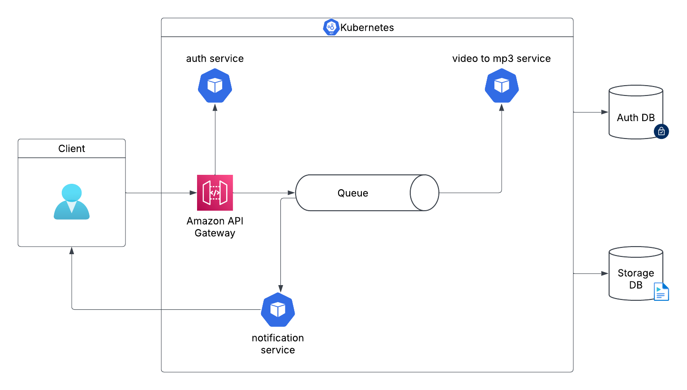

     

# Video to MP3 Converter

This application is a video to mp3 converter. It's solve the problem of converting video files to mp3 files.

## Architecture - Design System

## Installation

### *Docker*

To run the application using Docker, you need to have Docker installed on your machine. Access the documentation [here](https://docs.docker.com/get-started/get-docker/).

### *Kubernetes*

- To run the application you need *kubectl* and *minikube* installed on your machine. Access the kubeclt documentation [here](https://kubernetes.io/pt-br/docs/reference/kubectl/) and minikube documentation [here](https://minikube.sigs.k8s.io/docs/) to install.

- To manage Kubernetes Cluster, you need to install *k9s*. Access the documentation [here](https://github.com/derailed/k9s) to install.

### *Python*

To run the application you need to have Python installed on your machine. Access the documentation [here](https://www.python.org/downloads/) to install.

## Conventional Commits

This project uses the Conventional Commits specification. Access the documentation [here](https://www.conventionalcommits.org/en/v1.0.0/) to understand how to use it.
